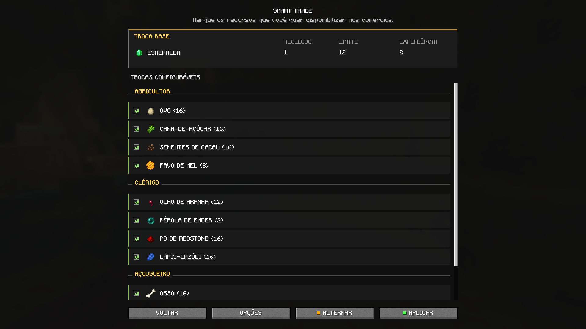

# SMART TRADE

O SMART TRADE é um mod client-side para singleplayer que adiciona nove trocas configuráveis com aldeões e quatro opções globais. A configuração é aberta pelo Mod Menu e salva em `config/smarttrade.json`. As regras de gameplay são executadas pelo servidor integrado do mundo; instalar o mod somente no cliente não oferece suporte a servidores multiplayer externos.

## Como a configuração funciona

- Marcar ou desmarcar entradas na interface não altera a configuração imediatamente: é necessário selecionar **APLICAR** na tela correspondente. O botão **ALTERNAR** marca todas as entradas quando pelo menos uma está desmarcada e desmarca todas quando todas estão marcadas.
- Na primeira instalação, quando `config/smarttrade.json` ainda não existe, as nove opções principais de troca começam marcadas e as quatro opções globais — **INFORMAÇÕES ADICIONAIS**, **REPUTAÇÃO MÁXIMA**, **VELOCIDADE CONDICIONADA** e **ALTURA LIMITADA** — começam desativadas.
- Configurações já salvas são carregadas e preservadas. Ao atualizar versões antigas, o mod migra os campos reconhecidos e descarta somente identificadores de troca que não pertençam à lista atual de nove opções. Se o arquivo não puder ser lido ou contiver JSON inválido, os padrões da primeira instalação são usados durante aquela execução.
- As alterações passam a ser usadas assim que são aplicadas. Fechar uma tela sem selecionar **APLICAR** descarta as mudanças ainda não salvas daquela tela.

## Regras comuns das trocas configuráveis

As quantidades da tabela abaixo são preços-base. Cada oferta:

- recebe somente o item indicado e entrega exatamente **1 esmeralda**;
- pode ser usada **12 vezes** antes de ficar sem estoque;
- adiciona **2 pontos de experiência ao aldeão** por negociação;
- gera para o jogador a experiência vanilla da negociação: **3 a 6 pontos**, ou **8 a 11 pontos** quando a mesma negociação inicia a subida de nível da profissão;
- usa multiplicador de preço **0,05 (5%)** para o cálculo vanilla de demanda. Demanda, reputação e outros modificadores vanilla podem alterar a quantidade efetivamente cobrada; o preço final é limitado pelo jogo entre **1** e o tamanho máximo da pilha do item, que é **64** para os nove itens;
- segue o reabastecimento vanilla do aldeão. Um reabastecimento zera os usos da oferta, e o aldeão pode se reabastecer no máximo **2 vezes por dia**; entre o primeiro e o segundo reabastecimento há um intervalo mínimo de **2.400 ticks (2 minutos a 20 ticks por segundo)**. O contador diário é reiniciado quando passam mais de **12.000 ticks (10 minutos a 20 ticks por segundo)** desde o último reabastecimento ou quando avança o dia da linha do tempo do Overworld. Local de trabalho, horário, acesso e demais requisitos vanilla para o aldeão trabalhar não são alterados.

Quando marcada, a oferta é inserida para qualquer aldeão da profissão correspondente, novo ou já existente e independentemente do nível da profissão. Ela é colocada depois das duas primeiras posições reservadas às ofertas vanilla de novato, sem substituir ofertas vanilla nem participar dos sorteios ou das probabilidades que as geram.

Quando desmarcada, a oferta deixa de ser adicionada aos aldeões que ainda não a possuem. Uma oferta da versão atual que já tenha sido gravada em um aldeão não é removida ao desmarcar a opção; ela continua disponível nesse aldeão com seus usos, demanda e demais dados preservados.

## Trocas disponíveis

| Opção | Comportamento exato |
| --- | --- |
| **OVOS** | O agricultor compra **20 ovos** pelo preço-base de **1 esmeralda**. |
| **SEMENTES DE CACAU** | O agricultor compra **20 sementes de cacau** pelo preço-base de **1 esmeralda**. |
| **FAVOS DE MEL** | O agricultor compra **10 favos de mel** pelo preço-base de **1 esmeralda**. |
| **OLHOS DE ARANHA** | O clérigo compra **15 olhos de aranha** pelo preço-base de **1 esmeralda**. |
| **PÉROLAS DO ENDER** | O clérigo compra **3 pérolas do Ender** pelo preço-base de **1 esmeralda**. |
| **PÓS DE REDSTONE** | O clérigo compra **20 pós de redstone** pelo preço-base de **1 esmeralda**. |
| **LÁPIS-LAZÚLI** | O clérigo compra **20 lápis-lazúli** pelo preço-base de **1 esmeralda**. |
| **OSSOS** | O açougueiro compra **20 ossos** pelo preço-base de **1 esmeralda**. |
| **FLECHAS** | O flecheiro compra **15 flechas** pelo preço-base de **1 esmeralda**. |

Ao carregar as ofertas de um aldeão, o mod também remove variantes antigas dessas mesmas trocas e, se a opção atual estiver marcada, insere a versão atual. São reconhecidos como preços-base legados: ovos **16**; sementes de cacau **16 ou 32**; favos de mel **8 ou 12**; olhos de aranha **12 ou 24**; pérolas do Ender **2 ou 4**; pós de redstone **16 ou 24**; lápis-lazúli **16 ou 24**; ossos **16 ou 32**; e flechas **12**. Também são removidas antigas ofertas do agricultor de **16 ou 32 canas-de-açúcar por 1 esmeralda**. Essa migração só reconhece ofertas com **12 usos máximos**, **2 XP para o aldeão**, sem segundo item de custo e com resultado de **1 esmeralda**, evitando remover trocas diferentes que apenas usem o mesmo item.

## Opções globais

### INFORMAÇÕES ADICIONAIS

Quando ativada e o mod [Jade](https://modrinth.com/mod/jade) está instalado, acrescenta três linhas ao painel de um aldeão observado:

- **Reputação:** a reputação total daquele aldeão em relação ao jogador que o observa. Valores maiores que **0** aparecem em verde e com sinal `+`, valores menores que **0** aparecem em vermelho e o valor **0** aparece em cinza.
- **Reabastecimentos:** o número de reabastecimentos realizados pelo aldeão no dia atual, exibido no formato `atual/2`.
- **Curado:** mostra **Sim** quando o aldeão possui, para o jogador que o observa, reputação do tipo vanilla `major_positive` maior que **0**; caso contrário, mostra **Não**.

A opção apenas controla essas informações no Jade: não altera reputação, cura, ofertas ou reabastecimentos. Sem o Jade, não há painel adicional. Quando **REPUTAÇÃO MÁXIMA** também está ativada, a linha de reputação mostra **+150**, porque esse é o valor que o aldeão passa a fornecer às consultas do jogo; a linha **Curado** continua baseada no dado real `major_positive`.

### REPUTAÇÃO MÁXIMA

Quando ativada, toda consulta à reputação de um jogador feita por qualquer aldeão retorna exatamente **150**. Isso afeta todas as ofertas do aldeão, tanto vanilla quanto adicionadas pelo SMART TRADE, sempre que o jogo calcula preços especiais ao abrir o comércio.

Para as nove ofertas do mod, cujo multiplicador é **0,05**, a contribuição desse valor ao preço especial é de **−7 itens** (`floor(150 × 0,05)`), antes da combinação com demanda e outros modificadores vanilla e respeitando o preço final mínimo de **1 item**. Ofertas vanilla mantêm seus próprios multiplicadores, preços-base, demanda, limites, usos e condições; portanto, a redução numérica pode ser diferente em cada uma.

Desativar a opção faz as consultas voltarem a usar a reputação real. O mod não escreve, apaga, aumenta nem reduz os registros reais de fofocas, negociações, agressões ou curas do aldeão.

### VELOCIDADE CONDICIONADA

Quando ativada, o encantamento **Velocidade das Almas** executa seus efeitos de localização e de movimento somente na dimensão do Nether. Fora do Nether, uma entidade viva que possua qualquer nível do encantamento e esteja sobre um bloco da tag `minecraft:soul_speed_blocks` tem o fator de velocidade desse bloco fixado em **1,0**, mantendo movimento normal em vez da aceleração do encantamento.

No conteúdo vanilla, `minecraft:soul_speed_blocks` contém exatamente **areia das almas** e **terra das almas**; datapacks ou outros mods podem acrescentar blocos à mesma tag. A verificação considera tanto o bloco na posição da entidade quanto o bloco inferior usado pelo jogo para afetar o movimento.

A opção não remove o encantamento dos equipamentos, não altera seu nível e não modifica movimento sobre esses blocos para entidades sem Velocidade das Almas. No Nether, todos os efeitos do encantamento permanecem vanilla. Quando a opção está desativada, o encantamento também permanece vanilla em todas as dimensões.

### ALTURA LIMITADA

Quando ativada, a opção interfere somente em tentativas de crescimento iniciadas com **pó de osso** e somente nos casos abaixo:

- **Cogumelo vermelho** sobre **nicélio carmesim ou nicélio distorcido:** o caule usa altura exata de **5 blocos**, da camada de origem até a quarta camada acima; a copa chega à quinta camada acima da origem. Assim, a estrutura pode ocupar **6 camadas verticais** contando a camada de origem.
- **Cogumelo marrom** sobre **nicélio carmesim ou nicélio distorcido:** o caule usa altura exata de **4 blocos**, da camada de origem até a terceira camada acima; a copa fica na quarta camada acima da origem. Assim, a estrutura pode ocupar **5 camadas verticais** contando a camada de origem.
- **Muda da selva** ou **muda de acácia:** quando aquela aplicação de pó de osso efetivamente gera a árvore, o gerador do tronco recebe altura exata de **6 blocos**. Folhas, copa, galhos e a forma total da estrutura continuam definidos pelo gerador vanilla e podem ultrapassar a altura do tronco.
- **Fungo carmesim** ou **fungo distorcido:** quando cultivado sobre seu bloco vanilla obrigatório — respectivamente, **nicélio carmesim** ou **nicélio distorcido** — a altura-base do caule é fixada em **6 blocos**. A chance vanilla de **1 em 12 (aproximadamente 8,33%)** de duplicar essa altura continua ativa, portanto o caule usa **6 blocos em 11 de 12 casos (aproximadamente 91,67%)** e **12 blocos em 1 de 12 casos (aproximadamente 8,33%)**. A copa pode ocupar também a camada imediatamente acima do caule; contando a camada de origem, a extensão vertical pode chegar a **7 camadas** no primeiro caso e **13 camadas** no segundo.

A opção não força o crescimento e preserva as chances de sucesso do pó de osso: **40%** para cogumelos, **40%** para fungos do Nether e **45%** por aplicação em mudas. Também permanecem válidas todas as verificações vanilla de bloco de suporte, espaço livre, altura do mundo e substituição de blocos; se uma delas falhar, a estrutura não é gerada.

Crescimento natural, geração do mundo, cogumelos plantados sobre qualquer bloco diferente dos dois tipos de nicélio, outras mudas, outras árvores e outras plantas não recebem altura fixa. Nas mudas, uma aplicação de pó de osso que apenas muda a muda do estágio **0** para o estágio **1** não gera árvore e, por isso, ainda não aplica a altura ao tronco; a altura fixa só vale se a geração ocorrer dentro de uma aplicação posterior de pó de osso.
